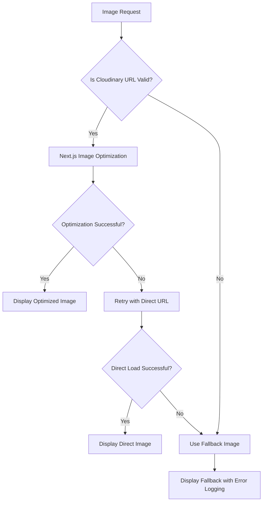

# Design Document

## Overview

This design addresses the critical image loading failures affecting the ColorTech website. The solution involves a comprehensive approach to fix Cloudinary image loading issues, resolve the "Unknown action: is-mobile" JavaScript error, and implement robust image handling with proper fallbacks and error recovery mechanisms.

## Architecture

### Current Issues Identified

1. **Dynamic Image Source Problem**: The hero image uses `(window as any).__APP_HERO_URL__` which may not be properly initialized
2. **Cloudinary URL Structure**: Images are failing with 400 errors, suggesting malformed URLs or invalid parameters
3. **Next.js Image Optimization**: The optimization pipeline may be corrupting Cloudinary URLs
4. **JavaScript Error**: "Unknown action: is-mobile" suggests a client-side hydration or action dispatch issue
5. **Error Handling**: Missing proper fallback mechanisms for failed image loads

### Solution Architecture



## Components and Interfaces

### 1. Image Loading Service

```typescript
interface ImageLoadingService {
  validateCloudinaryUrl(url: string): boolean;
  generateOptimizedUrl(url: string, options: ImageOptions): string;
  handleImageError(error: Error, fallbackUrl: string): string;
  logImageFailure(url: string, error: Error): void;
}

interface ImageOptions {
  width?: number;
  height?: number;
  quality?: number;
  format?: 'auto' | 'webp' | 'jpg' | 'png';
  crop?: 'fill' | 'fit' | 'scale';
}
```

### 2. Enhanced Image Component

```typescript
interface EnhancedImageProps {
  src: string;
  alt: string;
  width?: number;
  height?: number;
  fallbackSrc?: string;
  onError?: (error: Error) => void;
  priority?: boolean;
  className?: string;
}
```

### 3. Mobile Detection Hook

```typescript
interface MobileDetectionHook {
  isMobile: boolean;
  isTablet: boolean;
  isDesktop: boolean;
  breakpoint: string;
}
```

## Data Models

### Image Configuration

```typescript
interface ImageConfig {
  cloudinaryBaseUrl: string;
  defaultFallbacks: {
    hero: string;
    gallery: string;
    blog: string;
    avatar: string;
  };
  optimizationSettings: {
    quality: number;
    formats: string[];
    sizes: number[];
  };
  retrySettings: {
    maxRetries: number;
    retryDelay: number;
  };
}
```

### Error Tracking

```typescript
interface ImageError {
  url: string;
  error: string;
  timestamp: Date;
  userAgent: string;
  retryCount: number;
  resolved: boolean;
}
```

## Error Handling

### 1. Image Loading Error Recovery

- **Primary Strategy**: Use Next.js Image component with proper error handling
- **Secondary Strategy**: Fall back to direct image loading if optimization fails
- **Tertiary Strategy**: Use predefined fallback images for different content types
- **Logging**: Track all image failures for debugging and monitoring

### 2. JavaScript Error Resolution

- **Mobile Detection**: Replace problematic mobile detection with robust `useIsMobile` hook
- **Action Dispatch**: Ensure all client-side actions are properly defined and handled
- **Hydration**: Implement proper client-side hydration checks

### 3. Cloudinary URL Validation

```typescript
const validateCloudinaryUrl = (url: string): boolean => {
  const cloudinaryPattern = /^https:\/\/res\.cloudinary\.com\/[^\/]+\/image\/upload\//;
  return cloudinaryPattern.test(url);
};

const sanitizeCloudinaryUrl = (url: string): string => {
  // Remove invalid parameters
  // Ensure proper encoding
  // Validate transformation parameters
  return sanitizedUrl;
};
```

## Testing Strategy

### 1. Unit Tests

- Image URL validation functions
- Error handling mechanisms
- Mobile detection hook
- Fallback image selection

### 2. Integration Tests

- Next.js Image component with Cloudinary URLs
- Error recovery workflows
- Client-side hydration scenarios
- Mobile/desktop responsive behavior

### 3. End-to-End Tests

- Full page image loading scenarios
- Network failure simulation
- Different device viewport testing
- Performance impact measurement

### 4. Manual Testing Checklist

- [ ] All hero images load correctly
- [ ] Gallery images display without errors
- [ ] Blog post images render properly
- [ ] Fallback images work when primary fails
- [ ] No JavaScript console errors
- [ ] Mobile detection works correctly
- [ ] Image optimization improves performance

## Implementation Phases

### Phase 1: Immediate Fixes
1. Fix dynamic hero image source
2. Implement basic error handling for existing images
3. Resolve "is-mobile" JavaScript error
4. Add fallback images for critical sections

### Phase 2: Enhanced Image Handling
1. Create comprehensive image loading service
2. Implement enhanced Image component wrapper
3. Add Cloudinary URL validation and sanitization
4. Implement retry mechanisms

### Phase 3: Monitoring and Optimization
1. Add image loading performance monitoring
2. Implement error tracking and reporting
3. Optimize image loading strategies based on data
4. Add automated testing for image loading scenarios

## Performance Considerations

### Image Optimization Strategy

1. **Lazy Loading**: Use Next.js Image component's built-in lazy loading
2. **Format Selection**: Prefer WebP with JPEG fallback
3. **Size Optimization**: Generate multiple sizes for responsive images
4. **Caching**: Implement proper cache headers for images
5. **Preloading**: Use priority loading for above-the-fold images

### Network Resilience

1. **Retry Logic**: Implement exponential backoff for failed requests
2. **Fallback CDN**: Consider multiple image sources
3. **Offline Support**: Cache critical images for offline viewing
4. **Progressive Loading**: Show low-quality placeholders while loading

## Security Considerations

### URL Validation

1. **Whitelist Domains**: Only allow trusted image domains
2. **Parameter Sanitization**: Validate all URL parameters
3. **XSS Prevention**: Properly escape image URLs and alt text
4. **Content Security Policy**: Configure CSP headers for image sources

### Error Information

1. **Sensitive Data**: Avoid exposing internal URLs in error messages
2. **Rate Limiting**: Prevent abuse of image loading endpoints
3. **Logging**: Sanitize logs to remove sensitive information